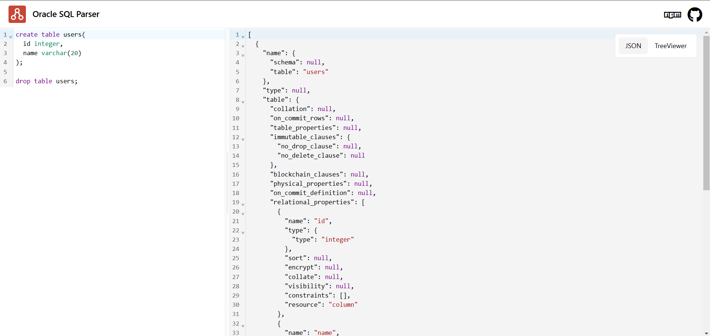

# Oracle SQL Playground

Explore the AST produced by the parser as a tree or json



### Run locally

```sh
git clone https://github.com/1ilit/oracle-sql-parser.git
cd oracle-sql-parser/playground
npm install
npm run dev
```
